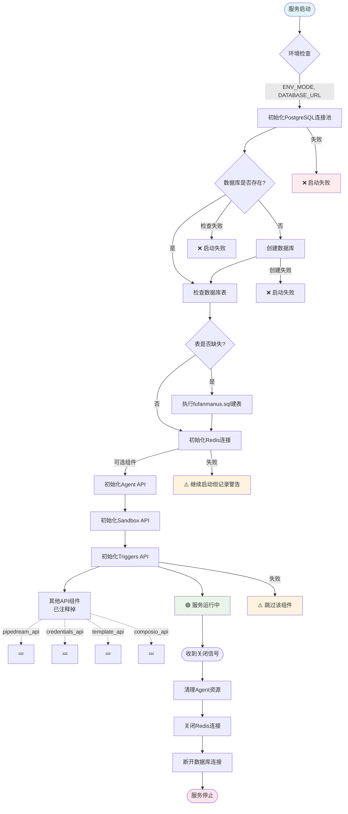
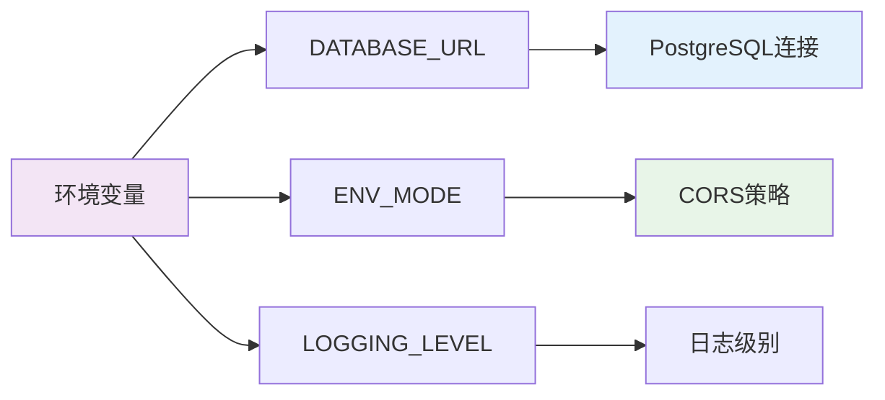

# FastAPI 服务初始化流程图

基于 `api.py` 中的 `lifespan` 函数分析的服务生命周期管理流程。

## 整体架构流程



## 关键组件说明

### 🔧 核心基础设施
- **PostgreSQL**: 主数据库，存储所有业务数据
  - 自动创建数据库（如不存在）
  - 基于 `fufanmanus.sql` 自动检查和创建16个核心表
- **Redis**: 缓存和会话存储
- **零配置启动**: 全自动数据库初始化，无需手动建库建表

### 🎯 业务组件
- **Agent API**: 核心AI代理服务，需要 `db` 和 `instance_id`
- **Sandbox API**: 代码执行沙盒环境
- **Triggers API**: 事件触发器系统

### 💤 暂停的组件
```
pipedream_api      # 工作流集成
credentials_api    # 凭证管理  
template_api       # 模板系统
composio_api       # Composio集成
```

### 🛡️ 错误处理策略
- **数据库连接失败**: 立即终止启动
- **Redis连接失败**: 记录警告但继续启动
- **可选组件失败**: 跳过该组件，不影响核心功能

## 配置依赖



## 数据库表结构

从 `fufanmanus.sql` 自动创建的16个核心表：

```
用户认证: users, oauth_providers, user_sessions, refresh_tokens, user_activities
项目管理: projects, threads, messages  
代理系统: agents, agent_versions, agent_workflows, agent_runs
ADK框架: app_states, sessions, events, user_states
``` 